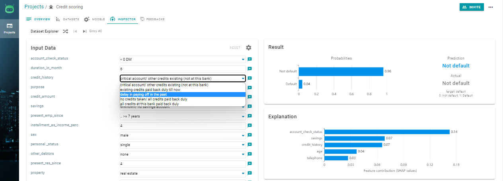
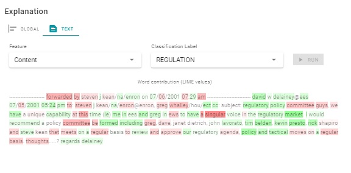
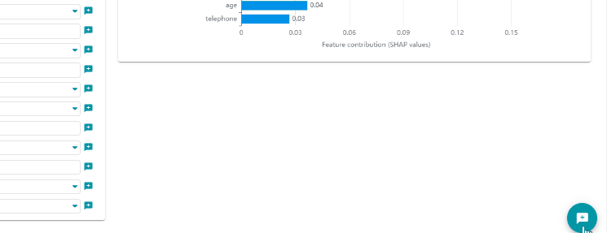

# Collect feedback of your ML model

:::{info}
To review your model, you can either

* Inspect it by yourself
* Invite peer ML engineer colleagues
* Invite business users who might have business knowledge of your model
:::

## Choose a model and a dataset to inspect

After [uploading your model](../upload-your-model/), you can inspect it by:

* Clicking on the Models tab
* Selecting the model version that you want to inspect by clicking on the Inspect button
* Selecting the dataset that you want to use for the inspection
* Selecting the actual target variable from your dataset. This is the true value of your target variable. If there is no actual target variable in your dataset, just select the blank cell

## Play with the model

You can play with the model by changing examples, feature values, or generating local explanations.

### Change example

Use the Next and Previous buttons of the Dataset Explorer to explore your dataset from one example to another.

You can also select the random button of the Data Explorer to explore randomly your dataset.

### Change the feature values of your example

You can also artificially change the feature values for a given example.&#x20;

By checking the change of the result and its explanation, you'll gain some insights into the local behavior of your model.

### Generate local explanations

#### Feature contribution with Shapley values

Every time you change examples or feature values, a local explanation is generated and provides the contribution of each feature to the final result.&#x20;

The explanation is given as a bar plot giving the absolute value of the [Shapley ](https://en.wikipedia.org/wiki/Shapley\_value)value for each feature: the longer the bar of a given feature, the greater its contribution to the final result of the model.

#### Word contribution with LIME values

You can also generate a text explanation to have a look at the contribution of each word on a text field. To do that, click on the tab TEXT in the explanation section,

* select a text feature you want to explain
* select the classification label for which you want to compute the word contribution

It then returns the [LIME ](https://christophm.github.io/interpretable-ml-book/lime.html)values of each word in your textual feature: green highlighting means a positive contribution to the selected classification label, while red highlighting means a negative contribution.

## Give feedback

Once you played with the model, you might have things to say about the behavior of the model. The Feedback button can help you.&#x20;

Here are some feedback examples:

* _Switching from 2012 to 2013 makes the prediction change a lot. This is weird!_
* _When I increase the credit amount, the default probability is decreasing. I would expect the reverse though._
* _This example is a very common case. It should have been treated differently!_
* _This feature has a very big importance to the final decision. I don't understand why..._
* _This feature value has no business sense. It should be modified._
* _When I replace the word "big" with "tall", the prediction is changing a Iot. I would expect the prediction to be invariant though…_

To send your feedback, you have two possibilities.

### 1. Provide feedback by feature

To provide feedback by feature, click on the green feedback button on the right of the feature field

.gif>)

### 2. Provide general feedback

If your feedback is related to the whole example, you may send general feedback by clicking on the Feedback bottom at the bottom right&#x20;

## Analyze the collected feedback

To analyze feedback, select the Feedback tab. It lists all the feedback that were collected in your project.

### Filter and group the feedback

To better target some feedback, you can filter them depending on:

* Model version
* Dataset
* Type of feedback: value perturbation, by feature or general

You can also aggregate the feedback using the "Group by feature" checkbox.&#x20;

:::{info}
Grouping feedback by feature enables you to check which feature collected the most feedback. Analyzing your feedback allows you to schedule your feature engineering tasks for your next model version.
:::

### Discuss feedback

You can click on particular feedback to re-inspect the example and discuss it with the feedback provider.

.png>)

:::{info}
Discussion can be important to clarify the feedback context and find the best action to correct the model.
:::

## Troubleshooting

If you encounter any issues, join our [**Discord**](https://discord.gg/fkv7CAr3FE) on our #support channel. Our community will help!&#x20;
